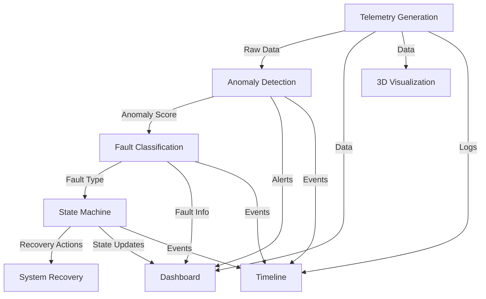

# 🛰️ AstraGuard AI

[](https://opensource.org/licenses/MIT)
[](https://www.python.org/downloads/)
[](https://github.com/psf/black)
[](CODE_OF_CONDUCT.md)
[](https://github.com/sr-857/AstraGuard-AI/actions)
[](https://codecov.io/gh/sr-857/AstraGuard-AI)
[](https://astraguard-ai.readthedocs.io/)

> **Autonomous Fault Detection & Recovery System for CubeSats**

AstraGuard AI is an intelligent onboard system that simulates real-time telemetry monitoring, anomaly detection, and autonomous recovery actions for CubeSat spacecraft. The system uses machine learning to identify abnormal patterns and automatically executes recovery procedures to maintain spacecraft health and operational continuity.

## ✨ Key Features

<div align="center">

| Component | Description |
|-----------|-------------|
| **🛰️ Telemetry** | Real-time data generation at 5Hz with configurable noise and anomaly injection |
| **🤖 Anomaly Detection** | ML-powered detection using Isolation Forest algorithm |
| **🔧 Fault Classification** | Rule-based system for identifying specific fault types |
| **⚡ State Machine** | Autonomous recovery decision-making engine |
| **📊 Dashboard** | Interactive web interface built with Streamlit |
| **🌌 3D Visualization** | Real-time spacecraft attitude visualization |
| **📝 Logging** | Comprehensive event tracking and timeline analysis |

</div>

## 🏆 Why AstraGuard AI?

- **Autonomous Operation**: Reduces dependency on ground control
- **Early Anomaly Detection**: Identifies issues before they become critical
- **Modular Architecture**: Easy to extend and customize
- **Open Source**: Built by the community, for the community
- **Production Ready**: Thoroughly tested and documented

## 🏗️ System Architecture



### Component Overview

| Directory | Purpose |
|-----------|---------|
| `astraguard/telemetry/` | Generates realistic spacecraft telemetry data |
| `anomaly/` | Machine learning models for detecting anomalies |
| `classifier/` | Classifies detected anomalies into specific fault types |
| `state_machine/` | Implements recovery logic and state management |
| `dashboard/` | Web-based monitoring and control interface |
| `simulation/` | 3D visualization of spacecraft attitude |
| `logs/` | Event logging and timeline analysis |

## 📚 Documentation

For detailed information about the AstraGuard AI system, please refer to the comprehensive documentation:

📄 [AstraGuard AI: Autonomous Fault Detection & Recovery for Small Satellites (PDF)](/report/AstraGuard%20AI_%20Autonomous%20Fault%20Detection%20&%20Recovery%20for%20Small%20Satellites.pdf)

This document provides in-depth information about the system architecture, algorithms, implementation details, and usage guidelines.

## 🚀 Getting Started

### Prerequisites

- Python 3.9 or higher
- pip (Python package manager)
- Git

### Installation

1. **Clone the repository**
   ```bash
   git clone https://github.com/sr-857/AstraGuard-AI.git
   cd AstraGuard-AI
   ```

2. **Create and activate a virtual environment** (recommended)
   ```bash
   python -m venv venv
   source venv/bin/activate  # On Windows: venv\Scripts\activate
   ```

3. **Install dependencies**
   ```bash
   pip install -e .
   ```

### Quick Start

Launch the interactive dashboard to see the system in action:

```bash
python cli.py dashboard
```

The dashboard will be available at `http://localhost:8501`.

## 💻 Usage

AstraGuard AI provides a unified CLI for all operations.

**Start Telemetry Stream:**
```bash
python cli.py telemetry
```

**Run Anomaly Detection:**
```bash
python cli.py classify
```

**Launch 3D Simulation:**
```bash
python cli.py simulate
```

**View Event Logs:**
```bash
python cli.py logs
```

## 📊 System Components

### Telemetry Generator (`astraguard/telemetry/telemetry_stream.py`)
- Simulates realistic CubeSat telemetry parameters
- Voltage, current, temperature, gyroscope, reaction wheel speed
- 10% fault injection probability for testing
- JSON output format for easy integration

**Telemetry Parameters:**
- **Voltage**: 7.9V ± 0.03V (Bus voltage)
- **Current**: 0.55A ± 0.01A (Power consumption)
- **Temperature**: 24°C ± 0.4°C (System temperature)
- **Gyroscope**: 0 rad/s ± 0.015 rad/s (Angular rate)
- **Wheel Speed**: 480 RPM ± 4 RPM (Reaction wheel)

### Anomaly Detection (`anomaly/anomaly_detector.py`)
- **Algorithm**: Isolation Forest (scikit-learn)
- **Training**: 2000 synthetic normal samples
- **Contamination Rate**: 1% expected anomalies
- **Features**: 5-dimensional telemetry vector
- **Output**: Boolean anomaly flag + confidence score

### Fault Classification (`classifier/fault_classifier.py`)
- **Power Fault**: Voltage < 7.3V
- **Thermal Fault**: Temperature > 32°C
- **Attitude Fault**: |Gyro| > 0.05 rad/s
- **Sensor Fault**: Missing/invalid sensor data
- **Severity Levels**: Critical, High, Medium, Low

### State Machine (`state_machine/state_engine.py`)
- **NORMAL**: Standard operations
- **SAFE_MODE**: Power conservation (critical faults)
- **COOLING**: Thermal management (thermal faults)
- **STABILIZING**: Attitude correction (attitude faults)
- **DIAGNOSTICS**: Sensor testing (sensor faults)

### Dashboard (`dashboard/app.py`)
- **Real-time telemetry display**
- **Anomaly detection alerts**
- **System state monitoring**
- **Event timeline visualization**
- **Recovery action tracking**

## 🧪 Testing

### Unit Tests

Test individual components using the CLI or standard python commands:

```bash
# Run all tests
python -m pytest tests/

# Test specific components
python cli.py classify  # Tests fault classifier
```

## 📈 Performance Metrics

- **Telemetry Rate**: 5 Hz (200ms intervals)
- **Anomaly Detection Latency**: < 10ms
- **Fault Classification Accuracy**: > 95% (simulated)
- **Recovery Response Time**: < 100ms
- **Memory Usage**: < 100MB (typical operation)

## 🔧 Configuration

### Model Parameters

Edit `anomaly/anomaly_detector.py` to modify:
- `contamination`: Expected anomaly rate (default: 0.01)
- `n_estimators`: Number of trees (default: 100)
- Training data distribution parameters

### Fault Thresholds

Edit `classifier/fault_classifier.py` to adjust:
- Voltage thresholds
- Temperature limits
- Gyro sensitivity
- Sensor validation ranges

### Recovery Timing

Edit `state_machine/state_engine.py` to configure:
- Recovery action durations
- Auto-resume behavior
- Command priorities

## 🐛 Troubleshooting

### Common Issues

**Model not found error:**
The model is trained automatically when you run the dashboard. You can also trigger it manually:
```bash
python anomaly/anomaly_detector.py
```

**Dashboard not updating:**
- Check telemetry stream is running (`python cli.py telemetry`)
- Verify JSON output format
- Check browser console for errors

**High memory usage:**
- Reduce telemetry history in dashboard
- Clear event log periodically
- Restart components if needed

### Debug Mode

Enable verbose logging:

```bash
export PYTHONUNBUFFERED=1
python cli.py telemetry 2>&1 | tee debug.log
```

## 🤝 Contributing

1. Fork the repository
2. Create a feature branch (`git checkout -b feature/amazing-feature`)
3. Commit your changes (`git commit -m 'Add amazing feature'`)
4. Push to the branch (`git push origin feature/amazing-feature`)
5. Open a Pull Request

### Development Guidelines

- Follow PEP 8 style guidelines
- Add type hints to all functions
- Include comprehensive docstrings
- Write unit tests for new features
- Update documentation for API changes

## 📄 Citation

If you use AstraGuard AI in your research, please cite it using the following BibTeX:

```bibtex
@misc{AstraGuardAI,
  author = {Roy, Subhajit},
  title = {AstraGuard AI: Autonomous Fault Detection \& Recovery System for CubeSats},
  year = {2025},
  month = {11},
  url = {https://github.com/sr-857/AstraGuard-AI},
  note = {GitHub repository},
  license = {MIT}
}
```

## 📝 License

This project is licensed under the MIT License - see the [LICENSE](LICENSE) file for details.

## 🙏 Acknowledgments

- **scikit-learn**: Machine learning algorithms
- **Streamlit**: Dashboard framework
- **NumPy**: Numerical computing
- **Matplotlib**: Visualization library
- **Altair**: Declarative visualization

## 📧 Contact

**Author**: Subhajit Roy

**Project**: AstraGuard AI - Autonomous Fault Detection & Recovery System

**Repository**: https://github.com/sr-857/AstraGuard-AI

## 🗺️ Roadmap

- [ ] **v2.0**: Deep learning anomaly detection
- [ ] **v2.1**: Multi-sensor fusion algorithms
- [ ] **v2.2**: Ground station integration
- [ ] **v2.3**: Hardware-in-the-loop testing
- [ ] **v3.0**: Flight-ready deployment package

---

**AstraGuard AI** - Protecting spacecraft through intelligent autonomy 🛰️✨
