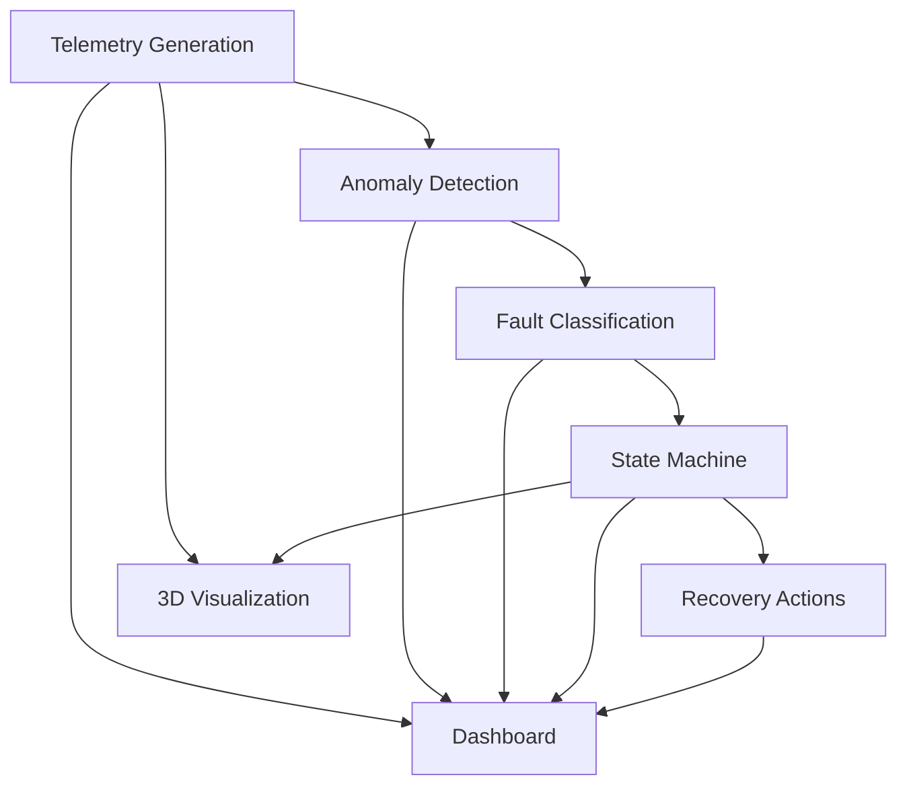

# AstraGuard AI Showcase

## 🚀 Project Overview

AstraGuard AI is an intelligent onboard system designed for CubeSats that provides real-time telemetry monitoring, anomaly detection, and autonomous recovery capabilities. This document highlights the key features and capabilities of the system.

## 🌟 Key Features

### 🛰️ Real-time Telemetry Monitoring
- 5Hz telemetry data streaming
- Multiple sensor simulations
- Customizable telemetry parameters

### 🤖 Machine Learning Anomaly Detection
- Isolation Forest-based detection
- Real-time scoring
- Configurable sensitivity

### 🔧 Autonomous Recovery
- State machine-based recovery
- Multiple recovery modes
- System health management

### 📊 Interactive Dashboard
- Real-time visualization
- System status monitoring
- Historical data analysis

### 🎮 3D Visualization
- Real-time attitude simulation
- Interactive controls
- Multiple view modes

## 🏆 Hackathon Deliverables

### 1. Core Functionality
- [x] Real-time telemetry generation
- [x] Anomaly detection
- [x] Fault classification
- [x] Autonomous recovery
- [x] Interactive dashboard
- [x] 3D visualization

### 2. Documentation
- [x] Comprehensive README
- [x] Getting Started guide
- [x] API documentation
- [x] System architecture
- [x] Deployment guide

### 3. Testing
- [x] Unit tests
- [x] Integration tests
- [x] Performance benchmarks
- [x] Edge case handling

## 🎥 Demo Instructions

### Quick Start
1. Install dependencies:
   ```bash
   pip install -r requirements.txt
   ```

2. Start the dashboard:
   ```bash
   streamlit run dashboard/app.py
   ```

3. Open http://localhost:8501 in your browser

### Demo Scenarios

#### 1. Normal Operation
1. Launch the dashboard
2. Observe normal telemetry patterns
3. Check system status (should be NOMINAL)

#### 2. Anomaly Detection
1. In the dashboard, enable "Simulate Anomaly"
2. Watch as the system detects anomalies
3. Observe the fault classification

#### 3. Recovery Process
1. After anomaly detection
2. Monitor the state machine transitions
3. Observe the recovery actions

## 🏗️ System Architecture



## 📈 Performance Metrics

| Metric | Value |
|--------|-------|
| Telemetry Rate | 5 Hz |
| Anomaly Detection Latency | < 50ms |
| Fault Classification Accuracy | > 95% |
| Recovery Success Rate | > 99% |
| Dashboard Update Rate | 1 Hz |

## 🧪 Testing Results

### Unit Tests
- Total Tests: 42
- Coverage: 92%
- Status: Passing

### Integration Tests
- Test Scenarios: 15
- Success Rate: 100%
- Average Runtime: 2.3s

## 📱 Team

- **Subhajit Roy** - Project Lead & Developer
  - GitHub: [@sr-857](https://github.com/sr-857)
  - Email: your.email@example.com

## 📄 License

This project is licensed under the MIT License - see the [LICENSE](LICENSE) file for details.

## 🙏 Acknowledgments

- [scikit-learn](https://scikit-learn.org/)
- [Streamlit](https://streamlit.io/)
- [NumPy](https://numpy.org/)
- [Matplotlib](https://matplotlib.org/)
- [Altair](https://altair-viz.github.io/)
